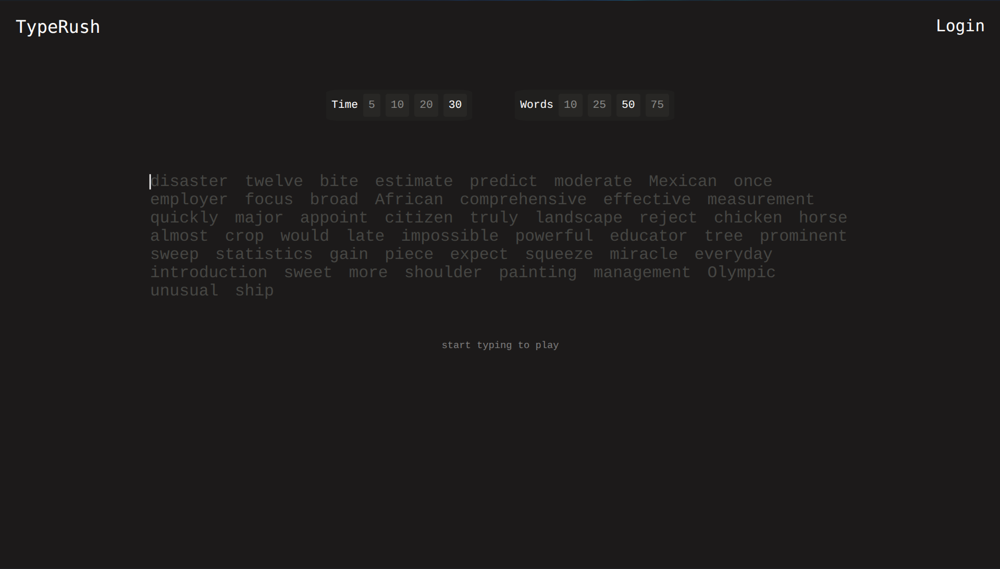

# TypeRush

> *A look at the main TypeRush visual interface.*

**TypeRush** is a comprehensive typing analytics assessment platform. Built as a full-stack web application, the project features a dynamic React frontend for tracking typing performance in real-time and a robust Python backend for storing user statistics.

## Key Features

*   **Interactive Typing Engine:** Provides a highly responsive typing experience powered by a custom React hook (`useTypingEngine`), which manages character-by-character validation (`pending`, `correct`, or `incorrect`) and real-time timer countdowns.
*   **Customizable Assessments:** Users can tailor their typing tests by adjusting specific parameters, such as the time duration (5, 10, 20, or 30 seconds) and target word counts (10, 25, 50, or 75 words).
*   **User Authentication:** Includes full account management with dedicated registration and login components, keeping user sessions secure and organized.
*   **Performance Statistics:** Automatically calculates and logs typing metrics (right words, wrong words, and total time) to a backend database, allowing users to review their historical performance through a dedicated Statistics dashboard.

## Project Structure

The codebase is modularly divided into a strict client-server architecture:
*   **`client/src/components/`**: Houses the visual React interfaces, including `TypingArea`, `Parameters`, `Authentification`, and `Statistics` panels.
*   **`client/src/hooks/`**: Contains core state logic, notably `useTypingEngine`, which independently manages word list fetching, character indexing, and time tracking.
*   **`client/src/utils/`**: Centralizes API communication logic (`apiCalls.tsx`) and TypeScript definitions (`dataTypes.tsx`) to enforce strict type safety across the frontend.
*   **`server/app/`**: Contains the Python FastAPI backend (`Server.py`), which manages cross-origin resource sharing (CORS), handles user authentication routes, and processes score submissions.
*   **Database Setup**: Utilizes native SQLite queries to manage a `typerush_raw.db` database, which stores tables for `users` and `scores`.

## Dependencies & Building

TypeRush relies on a full-stack ecosystem:
*   **Frontend Environment:** Node, React (with `react-router-dom`), CSS, and TypeScript.
*   **Backend Environment:** Python, FastAPI, Uvicorn, and native SQLite3.

To build and run the application locally, you can simply execute the provided **`dev.py`** script, which initializes both the frontend and backend development servers automatically.